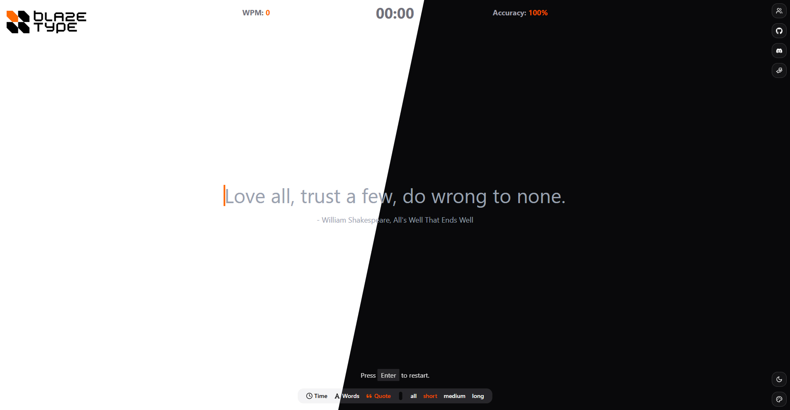

# Blaze Type ⚡

A typing test game built with Next.js, Tailwind CSS and ShadcnUI. Test your typing speed and accuracy with different modes, themes, and configurations.



## Features ✨

- **Multiple Game Modes**:
  - Time-based typing tests (15s, 30s, 60s, 120s)
  - Word-based typing tests (10, 25, 50, 100 words)
  - Quote typing tests (short, medium, long, all lengths)
  
- **Customization Options**:
  - Toggle punctuation and numbers in tests
  - Multiple color themes (Amber, Crimson, Rosewood, Emerald, Sapphire, Amethyst)
  - Light/dark mode support
  
- **Real-time Metrics**:
  - Words Per Minute (WPM) tracking
  - Accuracy percentage
  - Time elapsed display
  
## Technologies Used 🛠️

- **Frontend**:
  - Next.js 15 (App Router)
  - React 19
  - TypeScript
  - Tailwind CSS
  - Shadcn UI (for accessible components)
  - Lucide Icons
  - FontAwesome Icons

- **Build Tools**:
  - PNPM (package manager)
  - ESLint (code linting)
  - Prettier (code formatting)

## Installation 💻

1. Clone the repository:

   ```bash
   git clone https://github.com/0xHouss/blaze-type.git
   cd blaze-type
   ```

2. Install dependencies:

   ```bash
   pnpm i
   ```

3. Start the development server:

   ```bash
   pnpm dev
   ```

4. Open [http://localhost:3000](http://localhost:3000) in your browser.

## Deployment 🚀

Blaze Type is live and hosted on [Vercel](https://vercel.com), offering lightning-fast performance and seamless scalability.

🔗 **Live Demo**: [https://blaze-type.vercel.app](https://blaze-type.vercel.app)

The app is automatically deployed with every push to the `master` branch via Vercel's GitHub integration, ensuring continuous delivery and up-to-date features.

## Team 👥

- Takorabet Houssam (242431430718)
- Garid Raouf (242431574410)
- Benkritly Hakim (242431621020)
- Saadbouzid Syliane (242431750012)
- Machane Yanis (232331406304)
- Tandi Tashinga (23238ZWE19487)

## Contributing 🤝

Contributions are welcome! Please follow these steps:

1. Fork the repository
2. Create your feature branch (`git checkout -b feature/amazing-feature`)
3. Commit your changes (`git commit -m 'add some amazing feature'`)
4. Push to the branch (`git push origin feature/amazing-feature`)
5. Open a Pull Request

## License 📄

BlazeType is licensed under the [MIT License](/LICENSE). Feel free to use and share it as you like.

## Support 💖

If you enjoy using Blaze Type, consider giving us a star on GitHub! ⭐

[](https://github.com/0xHouss/blaze-type/stargazers)